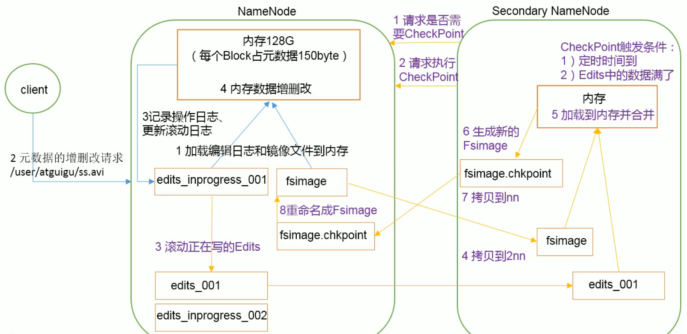

## 5. NameNode和SecondaryNameNode

### 5.1 NN和2NN工作机制

- NameNode中的元数据存储在哪里？

  ​	首先，我们做个假设，如果存储在 NameNode节点的磁盘中，因为经常需要进行随机访问，还有响应客户请求，必然是效率过低。因此，元数据需要存放在内存中。但如果只存在内存中，一旦断电，元数据丢失，整个集群就无法工作了。<font color="red">因此产生在磁盘中备份元数据的FsImage。</font>

  ​	这样又会带来新的问题，当在内存中的元数据更新时，如果同时更新FsImage，就会导致效率过低，但如果不更新，就会发生一致性问题，一旦 NameNode节点断电，就会产生数据丢失。<font color="red">因此，引入 Edits文件（只进行追加操作，效率很高）。每当元数据有更新或者添加元数据时，修改内存中的元数据并追加到 Edits中。</font>这样，一旦 NameNode节点断电，可以通过 FsImage和 Edits的合并，合成元数据。
  ​	但是，如果长时间添加数据到 Edits中，会导致该文件数据过大，效率降低，而且一旦断电，恢复元数据需要的时间过长。因此，需要定期进行 FsImage和 Edits的合并，如果这个操作由 NameNode节点完成，又会效率过低。因此，引入一个新的节点 Secondary Namenode，专门用于 FsImage和 Edits的合并。

- NameNode工作机制

  

### 5.2 FsImage和Edits解析

- 概念

  >NameNode被格式化之后，将在/ opt/module/hadoop-x.x.x/data/ tmp/dfs/name/current目录中产生如下文件：
  >			fsimage 0000000000000000000
  >			fsimage 0000000000000000000md5
  >			seen_txid
  >			VERSION
  >（1）Fsimage文件：HDFS文件系统元数据的一个永久性的检查点，其中包含HDFS文件系统所有目录和文件idnode的序列化信息
  >（2）Edits文件：存放HDFS文件系统的所有更新操作的路径，文件系统客户端执行的所有写操作首先会被记录到Edits文件中
  >（3） seen_txid件保存的是一个数字，就是最后一个edts的数字
  >（4）每次NameNode启动的时候都会将 Fsimage文件读入内存，加载Edits里面的更新操作，保证内存中的元数据信息是最新的、同步的，可以看成 NameNode动的时候就将 Fsimage和Edits文件进行了合并。

- oiv查看Fsimage文件

  - 命令

    ```bash
    $ hdfs
    ...
    oev  apply the offline edits viewer to an edits file
    oiv  apply the offline fsimage viewer to an fsimage
    
    $ hdfs oiv -p(输出格式) XML -i(输入) fsimage_xxxx -o(输出) fsimage.xml
    ```

  - fsimage.xml

    ```xml
    <?xml version="1.0"?>
    <fsimage>
    	<version>
    		<layoutVersion>-65</layoutVersion>
    		<onDiskVersion>1</onDiskVersion>
    		<oivRevision>b3cbbb467e22ea829b3808f4b7b01d07e0bf3842</oivRevision>
    	</version>
    	<NameSection>
    		<namespaceId>1962351574</namespaceId>
    		<genstampV1>1000</genstampV1>
    		<genstampV2>1000</genstampV2>
    		<genstampV1Limit>0</genstampV1Limit>
    		<lastAllocatedBlockId>1073741824</lastAllocatedBlockId>
    		<txid>0</txid>
    	</NameSection>
    	<ErasureCodingSection>
    		<erasureCodingPolicy>
    			<policyId>1</policyId>
    			<policyName>RS-6-3-1024k</policyName>
    			<cellSize>1048576</cellSize>
    			<policyState>DISABLED</policyState>
    			<ecSchema>
    				<codecName>rs</codecName>
    				<dataUnits>6</dataUnits>
    				<parityUnits>3</parityUnits>
    			</ecSchema>
    		</erasureCodingPolicy>
    		<erasureCodingPolicy>
    			<policyId>2</policyId>
    			<policyName>RS-3-2-1024k</policyName>
    			<cellSize>1048576</cellSize>
    			<policyState>DISABLED</policyState>
    			<ecSchema>
    				<codecName>rs</codecName>
    				<dataUnits>3</dataUnits>
    				<parityUnits>2</parityUnits>
    			</ecSchema>
    		</erasureCodingPolicy>
    		<erasureCodingPolicy>
    			<policyId>3</policyId>
    			<policyName>RS-LEGACY-6-3-1024k</policyName>
    			<cellSize>1048576</cellSize>
    			<policyState>DISABLED</policyState>
    			<ecSchema>
    				<codecName>rs-legacy</codecName>
    				<dataUnits>6</dataUnits>
    				<parityUnits>3</parityUnits>
    			</ecSchema>
    		</erasureCodingPolicy>
    		<erasureCodingPolicy>
    			<policyId>4</policyId>
    			<policyName>XOR-2-1-1024k</policyName>
    			<cellSize>1048576</cellSize>
    			<policyState>DISABLED</policyState>
    			<ecSchema>
    				<codecName>xor</codecName>
    				<dataUnits>2</dataUnits>
    				<parityUnits>1</parityUnits>
    			</ecSchema>
    		</erasureCodingPolicy>
    		<erasureCodingPolicy>
    			<policyId>5</policyId>
    			<policyName>RS-10-4-1024k</policyName>
    			<cellSize>1048576</cellSize>
    			<policyState>DISABLED</policyState>
    			<ecSchema>
    				<codecName>rs</codecName>
    				<dataUnits>10</dataUnits>
    				<parityUnits>4</parityUnits>
    			</ecSchema>
    		</erasureCodingPolicy>
    	</ErasureCodingSection>
    	<INodeSection>
    		<lastInodeId>16385</lastInodeId>
    		<numInodes>1</numInodes>
    		<inode>
    			<id>16385</id>
    			<type>DIRECTORY</type>
    			<name/>
    			<mtime>0</mtime>
    			<permission>jeffy:supergroup:0755</permission>
    			<nsquota>9223372036854775807</nsquota>
    			<dsquota>-1</dsquota>
    		</inode>
    	</INodeSection>
    	<INodeReferenceSection/>
    	<SnapshotSection>
    		<snapshotCounter>0</snapshotCounter>
    		<numSnapshots>0</numSnapshots>
    	</SnapshotSection>
    	<INodeDirectorySection/>
    	<FileUnderConstructionSection/>
    	<SecretManagerSection>
    		<currentId>0</currentId>
    		<tokenSequenceNumber>0</tokenSequenceNumber>
    		<numDelegationKeys>0</numDelegationKeys>
    		<numTokens>0</numTokens>
    	</SecretManagerSection>
    	<CacheManagerSection>
    		<nextDirectiveId>1</nextDirectiveId>
    		<numDirectives>0</numDirectives>
    		<numPools>0</numPools>
    	</CacheManagerSection>
    </fsimage>
    ```

  - <font color="red">在集群启动后，要求DataNode上报数据块信息，并间隔一段时间后再次上报。</font>所以，DataNode是防止数据丢失动态获取的，而不保存在fsimage中。

- oev查看Edits文件

  - 命令

    ```bash
    $ hdfs oev -p XML -i edits_xxx -o edits.xml
    ```

  - edits.xml

    ```xml
    <?xml version="1.0" encoding="UTF-8" standalone="yes"?>
    <EDITS>
    	<EDITS_VERSION>-65</EDITS_VERSION>
    	<RECORD>
    		<OPCODE>OP_START_LOG_SEGMENT</OPCODE>
    		<DATA>
    			<TXID>6</TXID>
    		</DATA>
    	</RECORD>
    	<RECORD>
    		<OPCODE>OP_ADD</OPCODE>
    		<DATA>
    			<TXID>7</TXID>
    			<LENGTH>0</LENGTH>
    			<INODEID>16389</INODEID>
    			<PATH>/usr/jeffy/input/xiaoxx.txt._COPYING_</PATH>
    			<REPLICATION>3</REPLICATION>
    			<MTIME>1592016405351</MTIME>
    			<ATIME>1592016405351</ATIME>
    			<BLOCKSIZE>134217728</BLOCKSIZE>
    			<CLIENT_NAME>DFSClient_NONMAPREDUCE_1494643959_1</CLIENT_NAME>
    			<CLIENT_MACHINE>192.168.93.101</CLIENT_MACHINE>
    			<OVERWRITE>true</OVERWRITE>
    			<PERMISSION_STATUS>
    				<USERNAME>jeffy</USERNAME>
    				<GROUPNAME>supergroup</GROUPNAME>
    				<MODE>420</MODE>
    			</PERMISSION_STATUS>
    			<ERASURE_CODING_POLICY_ID>0</ERASURE_CODING_POLICY_ID>
    			<RPC_CLIENTID>c8d7d7de-646d-4369-82bd-16bc5303e506</RPC_CLIENTID>
    			<RPC_CALLID>3</RPC_CALLID>
    		</DATA>
    	</RECORD>
    	<RECORD>
    		<OPCODE>OP_ALLOCATE_BLOCK_ID</OPCODE>
    		<DATA>
    			<TXID>8</TXID>
    			<BLOCK_ID>1073741825</BLOCK_ID>
    		</DATA>
    	</RECORD>
    	<RECORD>
    		<OPCODE>OP_SET_GENSTAMP_V2</OPCODE>
    		<DATA>
    			<TXID>9</TXID>
    			<GENSTAMPV2>1001</GENSTAMPV2>
    		</DATA>
    	</RECORD>
    	<RECORD>
    		<OPCODE>OP_ADD_BLOCK</OPCODE>
    		<DATA>
    			<TXID>10</TXID>
    			<PATH>/usr/jeffy/input/xiaoxx.txt._COPYING_</PATH>
    			<BLOCK>
    				<BLOCK_ID>1073741825</BLOCK_ID>
    				<NUM_BYTES>0</NUM_BYTES>
    				<GENSTAMP>1001</GENSTAMP>
    			</BLOCK>
    			<RPC_CLIENTID/>
    			<RPC_CALLID>-2</RPC_CALLID>
    		</DATA>
    	</RECORD>
    	<RECORD>
    		<OPCODE>OP_CLOSE</OPCODE>
    		<DATA>
    			<TXID>11</TXID>
    			<LENGTH>0</LENGTH>
    			<INODEID>0</INODEID>
    			<PATH>/usr/jeffy/input/xiaoxx.txt._COPYING_</PATH>
    			<REPLICATION>3</REPLICATION>
    			<MTIME>1592016407049</MTIME>
    			<ATIME>1592016405351</ATIME>
    			<BLOCKSIZE>134217728</BLOCKSIZE>
    			<CLIENT_NAME/>
    			<CLIENT_MACHINE/>
    			<OVERWRITE>false</OVERWRITE>
    			<BLOCK>
    				<BLOCK_ID>1073741825</BLOCK_ID>
    				<NUM_BYTES>7</NUM_BYTES>
    				<GENSTAMP>1001</GENSTAMP>
    			</BLOCK>
    			<PERMISSION_STATUS>
    				<USERNAME>jeffy</USERNAME>
    				<GROUPNAME>supergroup</GROUPNAME>
    				<MODE>420</MODE>
    			</PERMISSION_STATUS>
    		</DATA>
    	</RECORD>
    	<RECORD>
    		<OPCODE>OP_RENAME_OLD</OPCODE>
    		<DATA>
    			<TXID>12</TXID>
    			<LENGTH>0</LENGTH>
    			<SRC>/usr/jeffy/input/xiaoxx.txt._COPYING_</SRC>
    			<DST>/usr/jeffy/input/xiaoxx.txt</DST>
    			<TIMESTAMP>1592016407065</TIMESTAMP>
    			<RPC_CLIENTID>c8d7d7de-646d-4369-82bd-16bc5303e506</RPC_CLIENTID>
    			<RPC_CALLID>9</RPC_CALLID>
    		</DATA>
    	</RECORD>
    </EDITS>
    ```

  - <font color="red">seen_txid记录下次待合并的Edits文件</font>

### 5.3 CheckPoint时间设置

- 通常情况下，SecondaryNameNode每隔一小时执行一次

  [hdfs-default.xml]

  ```xml
  <property>
    <name>dfs.namenode.checkpoint.period</name>
    <value>3600s</value>
    <description>
      The number of seconds between two periodic checkpoints.
      Support multiple time unit suffix(case insensitive), as described
      in dfs.heartbeat.interval.
    </description>
  </property>
  ```

- 一分钟检查一次操作次数，当操作次数达到100w时，SecondaryNameNode执行一次

  [hdfs-default.xml]

  ```xml
  <property>
    <name>dfs.namenode.checkpoint.txns</name>
    <value>1000000</value>
    <description>The Secondary NameNode or CheckpointNode will create a checkpoint
    of the namespace every 'dfs.namenode.checkpoint.txns' transactions, regardless
    of whether 'dfs.namenode.checkpoint.period' has expired.
    </description>
  </property>
  
  <property>
    <name>dfs.namenode.checkpoint.check.period</name>
    <value>60s</value>
    <description>The SecondaryNameNode and CheckpointNode will poll the NameNode
    every 'dfs.namenode.checkpoint.check.period' seconds to query the number
    of uncheckpointed transactions. Support multiple time unit suffix(case insensitive),
    as described in dfs.heartbeat.interval.
    </description>
  </property>
  ```

### 5.4 NameNode故障处理

​	NameNode故障后，可以采用如下两种方法恢复故障

- 方法一：将SecondaryNameNode中的数据拷贝到NameNode存储数据的目录。

  1. kill -9 NameNode Progress

  2. 删除NameNode存储数据  -- ../hadoop-x.x.x/data/tmp/dfs/name

      ```bash
      $ rm -rf data/tmp/dfs/name
      ```

  3. 拷贝SecondaryNameNode中的数据到原NameNode存储数据目录

      ```bash
      $ scp -r jeffy@hadoop-103:/opt/module/hadoop-3.2.1/data/tmp/dfs/namesecondary/* ./name/
      ```

  4. 重启NameNode

      ```bash
      $ sbin/hadoop-daemon.sh start namenode
      或
      $ hdfs --daemon start namenode
      ```

- 方法二：使用**-importCheckpoint**选项启动NameNode守护进程，从而将SecondaryNameNode中数据拷贝到NameNode目录中。

  1. 修改 [hdfs-site.xml]

     ```xml
     <!--设置检查节点执行时间间隔 -->
     <property>
         <name>dfs.namenode.checkpoint.period</name>
         <value>120s</value>
     </property>
     
     <!-- 设置NameNode存储数据目录 -->
     <property>
         <name>dfs.namenode.name.dir</name>
         <value>/opt/module/hadoop-3.2.1/data/tmp/dfs/name/</value>
     </property>
     ```

  2. kill -9 NameNode Progress

  3. 删除NameNode存储的数据

  4. 如果SecondaryNameNode不和NameNode在同一个主机节点上，需要将SecondaryNameNode存储数据目录拷贝到NameNode存储数据的评级目录，并删除in_use.lock文件

  5. 导入检查点数据（等待一会，ctrl+c结束掉）

     ```bash
     $ bin/hdfs namenode -imoportCheckpoint
     ```

     发方法检查内容较多，更加规范，需要时间也较长

  6. 启动NameNode

### 5.5 集群安全模式

- 概述

  1. NameNode启动
     	NameNode启动时，首先将镜像文件（ Fsimage）载入內存，并执行编辑日志（Edits）中的各项操作。一旦在内存中成功建立文件系统元数据的映像，则创建一个新的 Fsimage文件和一个空的编辑日志。此时，NameNode开始监听 DataNode请求。<font color="red">这个过程期间， NameNode直运行在安全模式，即 NameNode的文件系统对于客户端来说是只读的。</font>

  2. DataNode启动

     ​	<font color="red">系统中的数据块的位置并不是由 NameNode维护的，而是以块列表的形式存储在 DataNode中。</font>在系统的正常操作期间， NameNode会在内存中保留所有块位置的映射信息。在安全模式下，各个 DataNode会向
     NameNode发送最新的块列表信息， NameNode了解到足够多的块位置信息之后，即可高效运行文件系统

  3. 安全模式退出判断

     ​	如果满足<font color="red">最小副本条件”， NameNode会在30秒钟之后就退出安全模式。</font>“所谓的最小副本条件指的是在整个文件系统中999的块满足最小副本级别（默认值： dfs replication. min=1）。<font color="red">在启动一个刚刚格式化的HDFS集群时，因为系统中还没有任何块，所以 NameNode不会进入安全模式。</font>

- 基本语法

  ​	集群处于安全模式，不能执行重要操作（写操作）。集群启动完成后，自动退出安全模式。

  ```bash
  // 查看安全模式状态
  $ bin/hdfs dfsadmin -safemode get
  Safe mode is OFF
  
  // 进入安全模式状态
  $ bin/hdfs dfsadmin -safemode enter
  Safe mode is ON
  $ bin/hdfs dfs -put ./input /
  put: Cannot create directory /input. Name node is in safe mode.
  
  // 离开安全模式状态
  $ bin/hdfs dfsadmin -safemode leave
  Safe mode is OFF
  
  // 等待安全模式状态
  $ bin/hdfs dfsadmin -safemode wait
  ```

- 案例 -- 模拟等待安全模式

  ```bash
  // 1.查看安全模式状态
  $ bin/hdfs dfsadmin -safemode get
  
  // 2.进入安全模式
  $ bin/hdfs dfsadmin -safemode enter
  
  // 3.创建并执行脚本
  $ touch safemode.sh
  $ vim safemode.sh
      #!/bin/bash
      hdfs dfsadmin -safemode wait
      hdfs dfs -put /home/jeffy/xiaoxx.txt /
  $ chmod safemode.sh 777
  $ bash safemode.sh
  ```

### 5.6 NameNode多目录配置

- NameNode的本地目录可以配置成多个，切每个目录存放内容相同，增加可靠性

- 配置文件

  [hdfs-site.xml]

  ```xml
  <property>
  	<name>dfs.namenode.name.dir</name>
      <value>file:///${hadoop.tmp.dir}/dfs/name1,file:///${hadoop.tmp.dir}/dfs/name2</value>
  </property>
  ```

- 停止集群、删除data/和logs/文件、修改配置文件、格式化NameNode