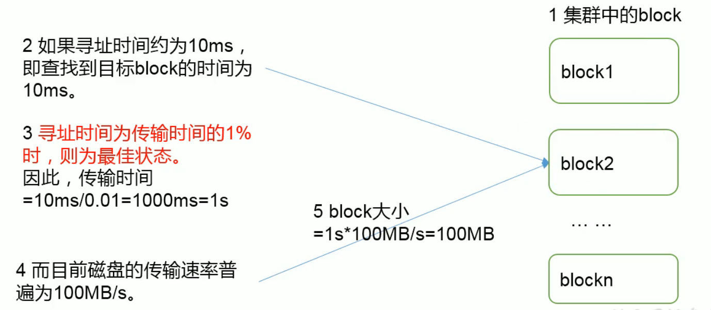

# 第一章  HDFS概述

## 1. HDFS产生背景及定义

1. 产生背景

...HDFS只是分布式文件管理系统的一种

2. HDFS定义

​	HDFS（Hadoop Distributed File System)， 它是一个文件系统，用于存储文件，通过目录树来定位文件；其次它是分布式的，由很多服务器联合起来实现其功能，集群中的服务器各有各自的角色。

​	HDFS的使用场景：适合一次写入，多次读取的场景，且不支持文件的修改。适合来做数据分析，并不适合做网盘应用。

## 2. HDFS的优缺点

### 2.1 优点

1. 高容错性

   数据自动保存多个副本。通过增加副本的形式，提高容错性

   某个副本丢失后，可以自动恢复

2. 适合处理大数据

   数据规模：能够处理数据规模达到GB、TB、PB的级别

   文件规模：能够处理百万规模以上的文件

3. 可以构建在廉价机上，通过多副本机制，提高可靠性 

### 2.2 缺点

1. 不适合低延时数据访问，比如毫秒级的存储数据时做不到的
2. 无法高效的对大量小文件进行存储
   1. 存储大量小文件，会占用NameNode大量的内存来存储文件目录和块信息。这样是不可取的，因为NameNode的内存是有限的
   2. 小文件存储的寻址时间会超过读取时间，它违反了HDFS的设计目标
3. 不支持并发写入、文件的修改
   1. 一个文件只能有一个写，不允许多个线程同时写
   2. 仅支持数据的追加append，不支持文件的随机修改

### 3. HDFS组成架构

1. NameNode（nn)：就是Master，他是一个主管、管理者
   1. 管理HDFS的命名空间
   2. 配置副本策略
   3. 管理数据块（Block）映射信息
   4. 处理客户端读写请求
2. DateNode：就是Slave。NameNode下达命令，DateNode执行实际操作
   1. 存储实际的数据块
   2. 执行数据块的读/写操作
3. Client：就是客户端
   1. 文件切片。文件上传HDFS的时候，客户端将文件切分成一个一个的Block，然后进行上传
   2. 与NameNode交互，获取文件的位置信息
   3. 与DateNode交互，读取或写入数据
   4. Client提供一些命令来管理HDFS，比如NameNode格式化
   5. Client通过一些命令来访问HDFS，比如HDFS增删改查操作
4. Secondary NameNode：并非NameNode的热备。当NameNode挂掉的时候，它并不能马上替换NameNode并提供服务
   1. 辅助NameNode，分担其工作量，比如定期合并Fsimage和Edits，并推送给NameNode
   2. 在紧急情况下，可辅助恢复NameNode

## 4. HDFS文件块大小

​	HDFS中文件在物理上是分块（Block）存储，块的大小可以通过配置参数 -- dfs.blocksize -- 来规定，默认大小在Hadoop2.x上是128M（3也是），老版本是64M

**思考：问什么块的大小不能设置太小或太大**

1. HDFS块太小，会增加寻址时间

2. 如果块太大，从磁盘传输数据会明显大于寻址时间。导致程序在处理这块数据时，会非常慢

   **HDFS块的大小设置主要取决于磁盘传输速率**