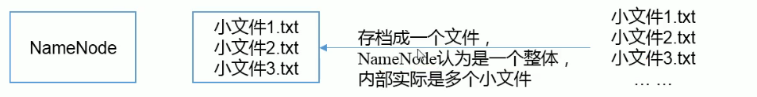
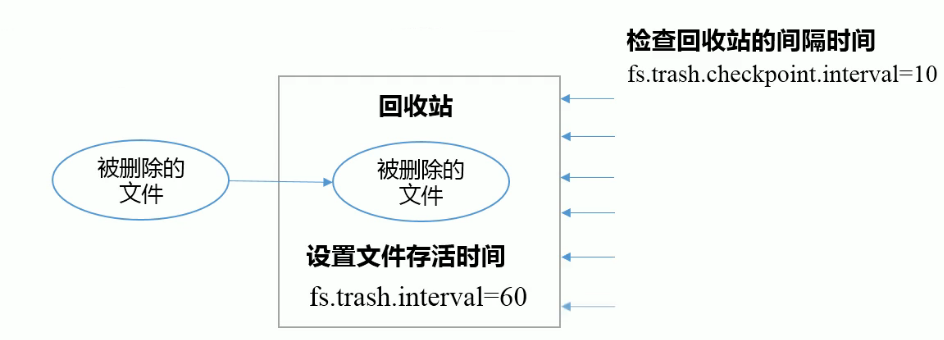

## 7. HDFS 2.x新特性

### 7.1. 集群之间的拷贝

1. scp实现两个远程主机之间的文件复制

   ```bash
   # push
   $ scp -r hello.txt root@hadoop-102:/usr/user/hello.txt
   # pull
   $ scp -r root@hadoop-102:/usr/user/hello.txt hello.txt
   # 通过本地主机中转实现两个远程主机的文件复制；如果两个远程主机之间ssh没有配置的情况下可以使用该方式
   $ scp -r root@hadoop-101:/usr/user/hello.txt root@hadoop-102:/usr/user/
   ```

2. 采用distcp命令实现两个Hadoop集群之间的递归数据复制

   ```bash
   $ bin/hadoop distcp hdfs://hadoop-101:9000/usr/user/hello.txt hdfs://hadoop-102:9000/usr/user/hello.txt
   ```


### 7.2. 小文件存档

1. HDFS存储小文件弊端

   ​	每个文件均按块存储，每个块的元数据存储在NameNode的内存中，因此HDFS存储小文件会非常低效。因为<font color="red">大量的小文件会耗尽NameNode中大部分内存。</font>但注意，存储小文件所需要的磁盘容量和数据块的大小无关。如，一个1MB的文件置为址128MB的块存储，实际使用的是1MB的磁盘空间，而不是128MB

2. 解决小文件办法之一

   ​	HDFS存档文件或HAR文件，是一个更高效的文件存档工具，它将文件存入HDFS块，在减少 NameNode内存使用的同时，允许对文件进行透明的访问。<font color="red">具体说来，HDFS存档文件对内还是一个一个独立文件，对 NameNode而言却是一个整体，减少了 NameNode的内存。</font>

   

3. 实际操作

   1. 启动yarn进程

   2. 归档文件

      ​	把/usr/user/input目录里面所有文件归当成一个叫input.har的归档文件，并把归档后文件存储到/usr/user/output路径下。

      ```bash
      $ bin/hadoop archive -archiveName input.har -p /usr/user/input /usr/user/output
      ```

   3. 查看归档文件

      ```bash
      # 查看归档后文件内容
      $ hadoop fs -ls -R /usr/user/output/input.har
      # 查看归档后原文件内容（har协议解析）
      $ hadoop fs -ls -R har:///usr/user/output/input.har
      ```

   4. 解归档文件

      ```bash
      hadoop fs -cp har:///usr/user/output.har/* /usr/user
      ```

### 7.3 回收站

​	开启回收站功能，可以将删除的文件在不超时的情况下，恢复原数据，起到防止误删除、备份等作用。

#### 7.3.1. 回收站的工作机制

1. 开启回收站功能参数说明
   - 默认值fs.trash.interval=0，0表示禁用回收站；其他值表示设置文件的存活时间
   - 默认值fs.trash.checkpoint.interval=0，检查回收站的时间间隔。如果该值为0，则该值设置于fs.trash.interval的参数相等
   - 要求fs.trash.checkpoint.interval <= fs.trach.interval

2. 回收站工作机制

   

#### 7.3.2 启用回收站

- core-default.xml

  ```xml
   <!-- 删除检查点之前n分钟的文件 -->
  <property>
    <name>fs.trash.interval</name>
    <value>0</value>
    <description>Number of minutes after which the checkpoint
    gets deleted.  If zero, the trash feature is disabled.
    This option may be configured both on the server and the
    client. If trash is disabled server side then the client
    side configuration is checked. If trash is enabled on the
    server side then the value configured on the server is
    used and the client configuration value is ignored.
    </description>
  </property>
  <!-- 检查点的时间间隔 -->
  <property>
    <name>fs.trash.checkpoint.interval</name>
    <value>0</value>
    <description> 
    </description>
  </property>
  ```
  
- 配置core-site.xml，这是垃圾回收时间为1分钟

  ```xml
  <property>
    <name>fs.trash.interval</name>
    <value>1</value>
  </property>
  ```
  
- 分发

  ```bash
  $ xsync ./core-site.xml
  ```

#### 7.3.3 修改访问垃圾回收站用户名称

​	进入垃圾回收站用户名称，默认是dr.who，修改为当前用户

​	[core-site.xml]

```xml
<property>
  <name>hadoop.http.staticuser.user</name>
  <value>jeffy</value>
</property>
```

​	通过程序删除的文件不会经过回收站，需要调用moveToTrash()才能进入回收站

```java
Trash trash = New Trash(conf);
trash.moveToTrash(path);
```

#### 7.3.4 查看回收站

​	路径：hdfs://hadoop-101:9000/user/jeffy/.Trash/

- 以时间戳命名文件夹归档满足保留时间的文件，并在

#### 7.3.5 恢复回收站数据

```bash
$ hadoop fs -mv /user/jeffy/.Trash/Current/user/jeffy/input/hello.txt /user/jeffy/input
```

#### 7.3.6 清空回收站

```bash
# 归档而非清除
$ hadoop fs -expunge
```

### 7.4 快照管理

​	快照相当于对目录做一个备份，并不会立即复制所有文件，而是指向同一个文件，当写入发生时，才会产生新文件。

1. 开启指定目录的快照功能

   ```bash
   $ hdfs dfsadmin -allowSnapshot <path>
   
   # 实操
   $ hdfs dfsadmin -allowSnapshot /usr/user/input/
   Allowing snapshot on /usr/user/input/ succeeded
   ```

2. 禁用指定目录的快照功能 -- 默认

   ```bash
   # 禁用之前需要先删除改目录的快照
   $ hdfs dfsadmin -disallowSnapshot <path>
   ```

3. 对目录创建快照

   ```bash
   $ hdfs dfs -createSnapshot <path>
   
   # 实操
   $ hdfs dfs -createSnapshot /usr/user/input/
   Created snapshot /usr/user/input/.snapshot/s20200630-204656.539
   ```

   不可见，需要手动输入/usr/user/input/.snapshot来进入目录

4. 指定名称创建快照 -- 默认名称为系统时间戳

   ```bash
   $ hdfs dfs -createSnapshot <path> <name>
   ```

5. 重命名快照

   ```bash
   $ hdfs dfs -renameSnapshot <path> <oldName> <newName>
   ```

6. 列出当前用户所有可（允许）快照目录

   ```bash
   $ hdfs lsSnapshottableDir
   
   # 实操
   $ hdfs lsSnapshottableDir
   drwxr-xr-x 0 jeffy supergroup 0 2020-06-30 20:46 1 65536 /usr/user/input
   ```

7. 比较两个快照目录的不同之处

   ```bash
   $ hdfs snapshotDiff <snapshotDir> <from> <to>
   
   $ hdfs snapshotDiff
   Usage: 
   hdfs snapshotDiff <snapshotDir> <from> <to>:
   	Get the difference between two snapshots, 
   	or between a snapshot and the current tree of a directory.
   	For <from>/<to>, users can use "." to present the current status,
   	and use ".snapshot/snapshot_name" to present a snapshot,
   	where ".snapshot/" can be omitted
   ```

8. 删除快照

   ```bash
   $ hdfs dfs -deleteSnashot <path> <snapshotName>
   ```

   

   

