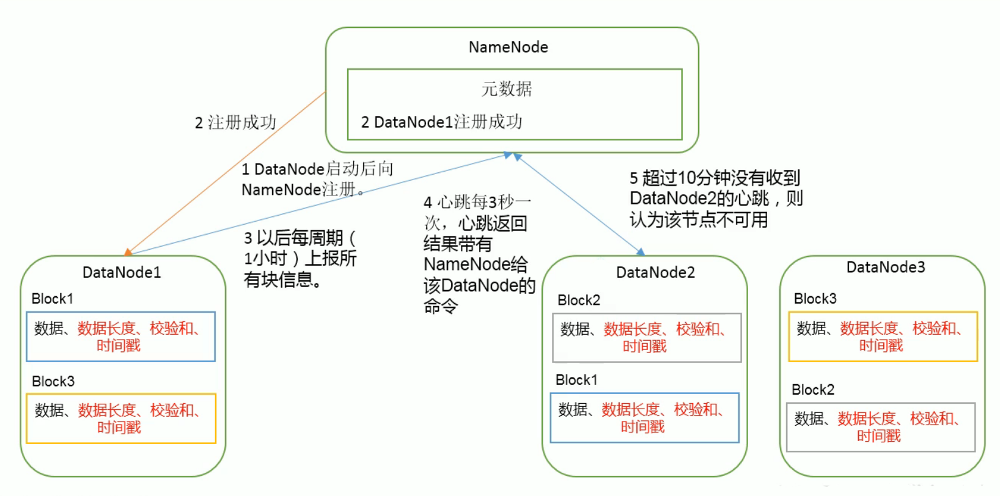
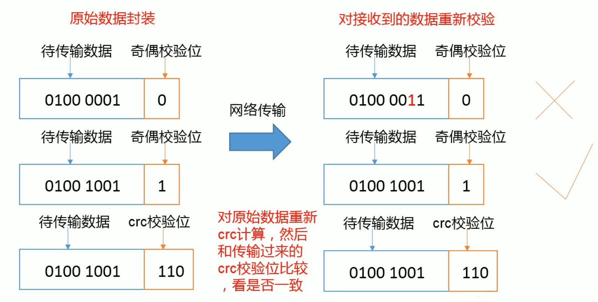
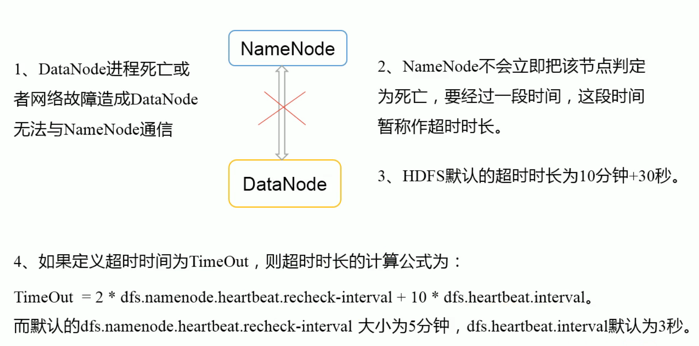

## 6. DataNode

### 6.1 DataNode工作机制

DataNode工作机制



### 6.2 数据完整性

DataNode节点保证数据完整性方法

1. 当DataNode读取Block的时候，它会计算CheckSum

2. 如果计算后的CheckSum与Block创建时值不一致，说明Block已经损坏

3. Client读取其他DataNode上的Block

4. DataNode在其他文件创建后周期验证CheckSum

   

### 6.3 掉线时限参数设置

 

[hsfs-site.xml] 

dfs.namenode.heartbeat.recheck-interval -- <font color="red">毫秒</font>

dfs.heartbeat.interval -- <font color="red">秒</font>

```xml
<property>
  <name>dfs.namenode.heartbeat.recheck-interval</name>
  <value>300000</value>
  <description>
    This time decides the interval to check for expired datanodes.
    With this value and dfs.heartbeat.interval, the interval of
    deciding the datanode is stale or not is also calculated.
    The unit of this configuration is millisecond.
  </description>
</property>

<property>
  <name>dfs.heartbeat.interval</name>
  <value>3s</value>
  <description>
    Determines datanode heartbeat interval in seconds.
    Can use the following suffix (case insensitive):
    ms(millis), s(sec), m(min), h(hour), d(day)
    to specify the time (such as 2s, 2m, 1h, etc.).
    Or provide complete number in seconds (such as 30 for 30 seconds).
  </description>
</property>
```

### 6.4 服役新数据几点

- 需求

  随着公司业务的增长，数据量越来越大，原有的数据节点的容量已经不能满足存储数据的需求，需要在原有集群基础上动态添加新的数据节点。

- 环境准备
  1. 增加新的服务器 -- （在103主机上克隆出104）
  2. 修改ip和主机名称
  3. <font color="red">删除原来HDFS文件系统留存的文件（./hadoop-3.2.1/data和log）</font>
  4. soutce /etc/profile

- 测试

  在新增主机节点上运行命令

  ```bash
  $ hdfs dfs -mkdir -p /usr/user
  # 因为在104主机上上传文件，主机节点最近，必有一份副本
  $ hdfs dfs -put ./xxx.txt /usr/user
  
  ```

### 6.5 退役旧数据节点

#### 6.5.1 添加白名单

​	添加白名单的主机节点，都允许访问NameNode，不在白名单的主机节点，都会被退出。

​	配置白名单步骤

  1. 在NameNode的./hadoop-3.2.1/etc/hadoop目录下创建dfs.hosts文件，添加主机名称

     ```hsots
     hadoop-101
     hadoop-102
     hadoop-103
     ```

  2. 在NameNode的hdfs-site.xml配置文件中增加dfs.hosts属性

     ```xml
     <property>
     	<name>dfs.hosts</name>
         <value>/opt/module/hadoop-3.2.1/etc/hadoop/dfs.hosts</value>
     </property>
     ```

  3. 配置文件分发

     ```bash
     $ xsync hdfs-site.xml
     ```

  4. 刷新NameNode

     ```bash
     $ hdfs dfsadmin -refreshNodes
     Refresh nodes successful
     ```

     <font color="red">如果副本数大于退役后的datanode数则无法退役成功</font>

  5. 如果数据不均衡，可以用命令实现集群的再平衡

     ```bash
     $ sbin/start-balancer.sh
     ```

#### 6.5.2 黑名单退役

1. 在NameNode主机下的hadoop-3.2.1/etc/hadoop目录下创建dfs.hosts.exclude文件，并添加退役主机，如：hadoop-105

2. 在NameNode的hdfs-site.xml配置中心增加dfs.hosts.exclude属性

   ```xml
   <property>
   	<name>dfs.hosts.exclude</name>
       <value>/opt/module/hadoop-3.2.1/etc/hadoop/dfs.hosts.exclude</value>
   </property>
   ```

3. 分发

4. 刷新

5. <font color="red">确保黑名单和白名单中不能出现同一个主机<br>在-refreshNodes时，程序会自动读取dfs.hosts和dfs.hosts.exclude文件，而不是根据配置中心是否配置读取</font>

### 6.6 DataNode多目录配置

1. DataNode也可以配置多个目录，每个目录存储的数据不一样 -- 数据不是副本

2. 配置hdfs-site.xml

   ```xml
   <property>
   	<name>dfs.datanode.data.dir</name>
       <value>file:///${hadoop.tmp.dir}/dfs.data1,file:///${hadoop.tmp.dir}/dfs.data2</value>
   </property>
   ```

3. 分发、停止服务、删除数据（./data ./logs）、格式化namenode、启动服务