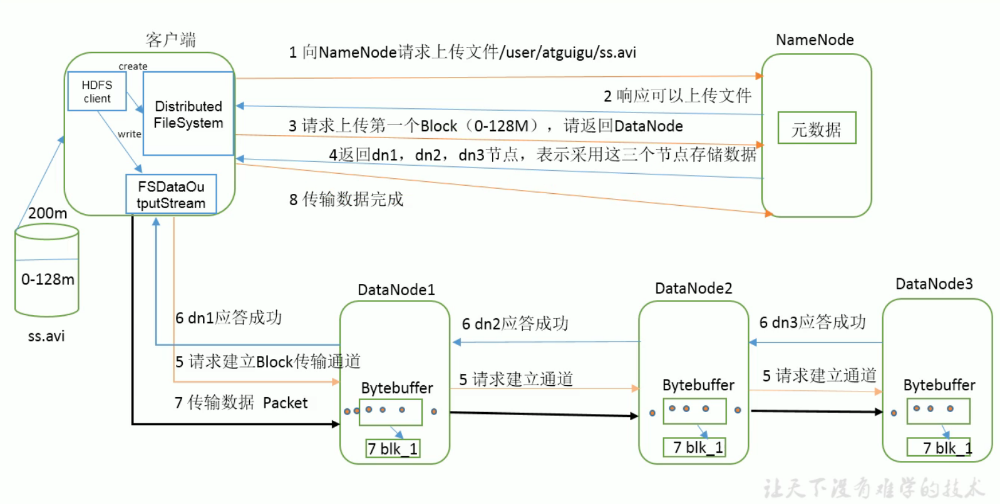
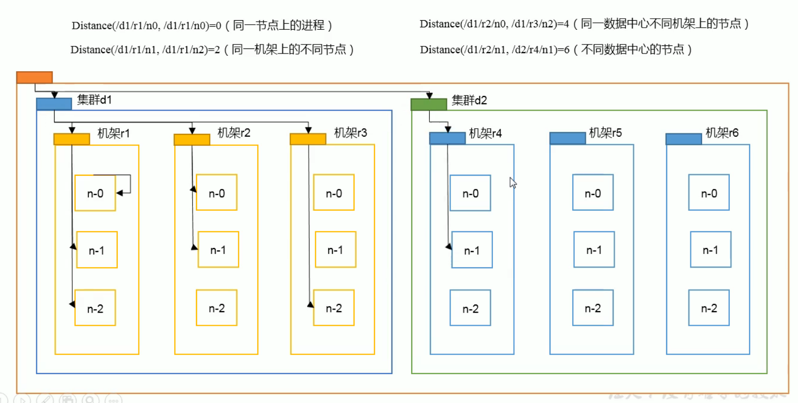
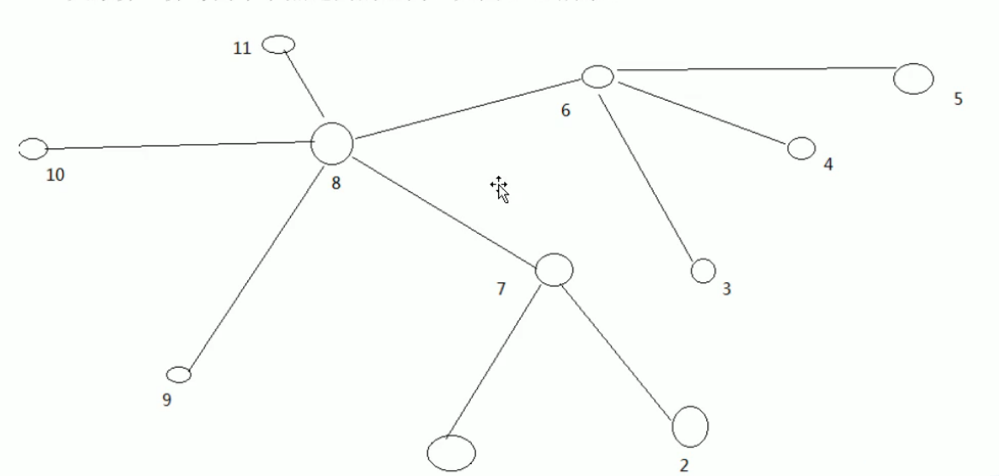
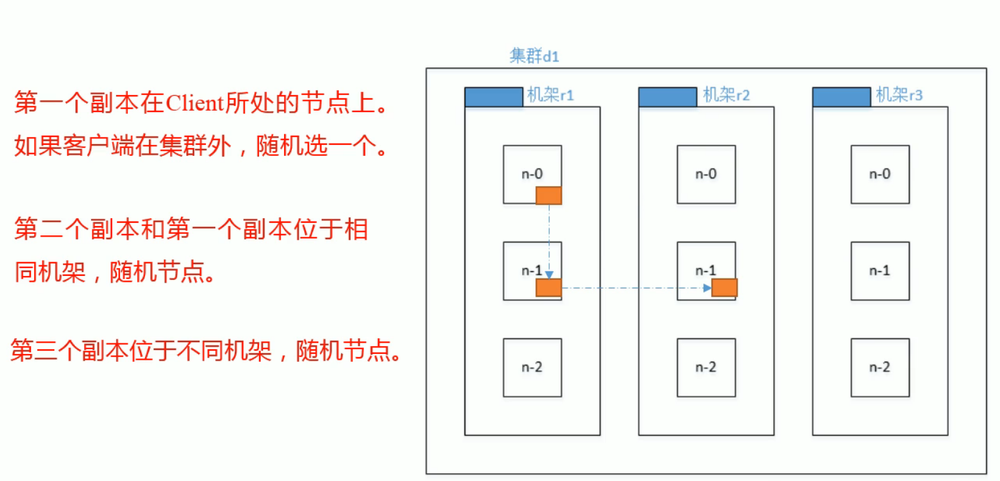
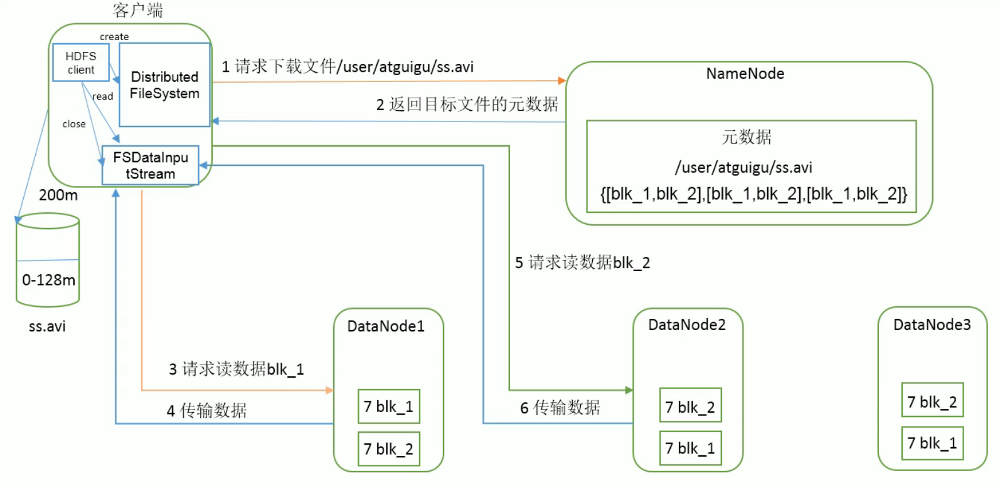

## 4. HDFS数据流

### 4.1 HDFS写数据流程

#### 4.1.1 剖析文件写入

​	HDFS写数据流程 

#### 4.1.2 网络拓扑 -- 节点距离计算

节点距离：两个节点到达最近的共同祖先的距离总和

​	如：假设有数据中心d1机架r1中的节点n1。该节点可以表示为d1/r1/n1。利用这种标记，可以给出死重距离描述。

#### 4.1.3 机架感知 -- 副本存储节点选择

##### 1.官方IP地址

​	机架感知说明

> https://hadoop.apache.org/docs/stable/hadoop-project-dist/hadoop-hdfs/HdfsDesign.html#Data_Replication
>
> 
>
> For the common case, when the replication factor is three, HDFS’s placement policy is to put one replica on the local machine if the writer is on a datanode, otherwise on a random datanode in the same rack as that of the writer, another replica on a node in a different (remote) rack, and the last on a different node in the same remote rack. This policy cuts the inter-rack write traffic which generally improves write performance. The chance of rack failure is far less than that of node failure; this policy does not impact data reliability and availability guarantees. However, it does reduce the aggregate network bandwidth used when reading data since a block is placed in only two unique racks rather than three. With this policy, the replicas of a file do not evenly distribute across the racks. One third of replicas are on one node, two thirds of replicas are on one rack, and the other third are evenly distributed across the remaining racks. This policy improves write performance without compromising data reliability or read performance.
>
> If the replication factor is greater than 3, the placement of the 4th and following replicas are determined randomly while keeping the number of replicas per rack below the upper limit (which is basically `(replicas - 1) / racks + 2`).

### 4.2 HDFS读数据流程

