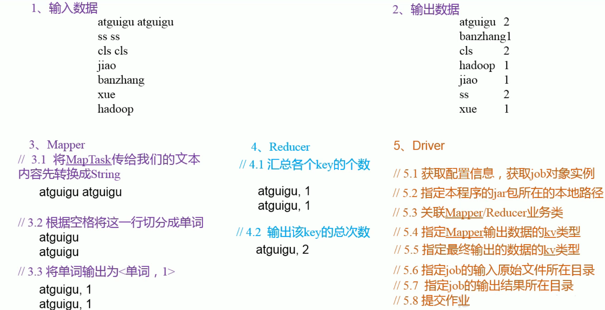

## 1. MapReduce概述

### 1.1 MapReduce定义

​	MapReduce是一个分布式运算程序的编程框架，是用户开发“基于 Hadoop的数据分析应用”的核心框架。

​	Mapreduce核心功能是将用户编写的业务逻辑代码和自带默认组件整合成一个完整的分布式运算程序，并发运行在一个 Hadoop集群上

### 1.2 MapReduce的优缺点

#### 1.2.1 优点

 1. MapRedu ce易于编程

    它简单的实现一些接口，就可以完成一个分布式程序，这个分布式程序可以分布到大量廉价的PC机器上运行。也就是说你写一个分布式程序，跟写个简单的串行程序是一模一样的。就是因为这个特点使得 MapReduce编程变得非常流行。

 2. 良好的扩展性

    当你的计算资源不能得到满足的时候，你可以通过简单的增加机器来扩展它的计算能力。

3. 高容错性

   MapReduce设计的初衷就是使程序能够部署在廉价的PC机器上，这就要求它具有很高的容错性。比如其中一台机器挂了，它可以把上面的计算任务转移到另外一个节点上运行，不至于这个任务运行失败，而且这个过程不需要人工参与，而完全是由 Hadoop内部完成的。

4. 适合PB级以上海量数据的离线处理

   可以实现上千台服务器集群并发工作，提供数据处理能力

#### 1.2.2 缺点

1. 不擅长实时计算

   Mapreduce无法像 MySQL一样，在毫秒或者秒级内返回结果。

2. 不擅长流式计算

   流式计算的输入数据是动态的，而MapReduce的输入数据集是静态的，不能动态 变化。这是因为 MapReduce自身的设计特点决定了数据源必须是静态的。

3. 不擅长DAG（有向图）计算

   多个应用程序存在依赖关系，后一个应用程序的输入为前一个的输出。在这种情况下，MapReduce并不是不能做，而是使用后，每个MapReduce作业的输出结果都会写入到磁盘，会造成大量的磁盘IO，导致性能非常的低下

#### 1.3 MapReduce核心思想

1. MapReduce核心思想

   

#### 1.4 官方WordCount源码

​	源码中包含Map类、Reduce类和驱动类。且数据的类型是Hadoop自身分装的序列化类型。

#### 1.5 常用的序列化类型

| Java类型 | Hadoop Writable类型           |
| -------- | ----------------------------- |
| boolean  | BooleanWritable               |
| byte     | ByteWritable                  |
| int      | IntWritable                   |
| float    | FloatWritable                 |
| long     | LongWritable                  |
| double   | DoubleWritable                |
| String   | Text |
| map      | MapWritable                   |
| array    | ArrayWritable                 |

#### 1.6 MapReduce进程

​	一个完整的MapReduce程序在分布式运行时有三类实力进程：

1. MrAppMaster：负责整个程序的过程调度及状态协调
2. MapTask：负责Map阶段的整个数据处理流程
3. ReduceTask：负责Reduce阶段的整个数据的处理流程

#### 1.7 MapReduce编程规范

​	用户编写的程序分成三个部分：Mapper、Reducer和Driver。

1. Mapper阶段

   - 用户自定义的Mapper要继承自己的父类
   - Mapper的输入数据是K-V形式（K-V类型可自定义）
   - Mapper中的业务逻辑写在map()方法中
   - Mapper的输出数据是K-V形式（K-V类型可自定义）
   - map()方法（MapTask进程）对每个<K, V>调用一次

2. Reducer阶段

   - 用户自定义的Reducer要继承自己的父类
   - Reducer的输入类型对应Mapper的输出数据类型，也是K-V
   - Reducer的业务逻辑写在reduce()方法中
   - ReduceTask进程对每一组相同的k的<K, V>z组调用一次reduce()方法

3. Driver阶段

   ​	相当于YARN集群的客户端，用于提交我们整个程序到YARN集群，提交的是封装了Mapreduce程序相关运行参数的job对象

#### 1.8 WordCount案例实操

1. 需求

   在给定文本文件中统计输出每一个单词出现的总次数

2. 需求分析

   按照MapReduce编程规范，分别编写Mapper、Reducer、Driver

   

