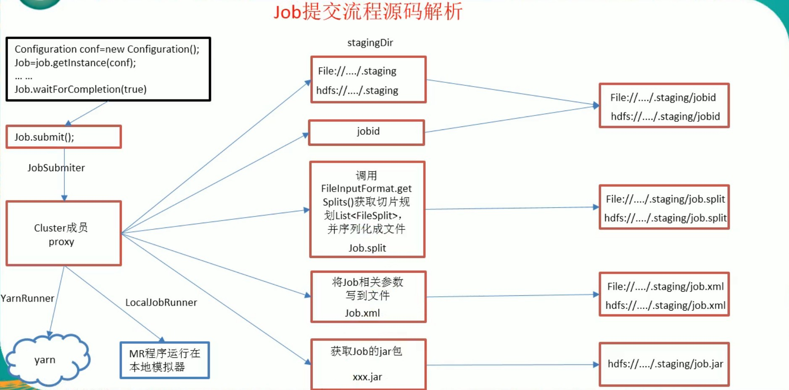
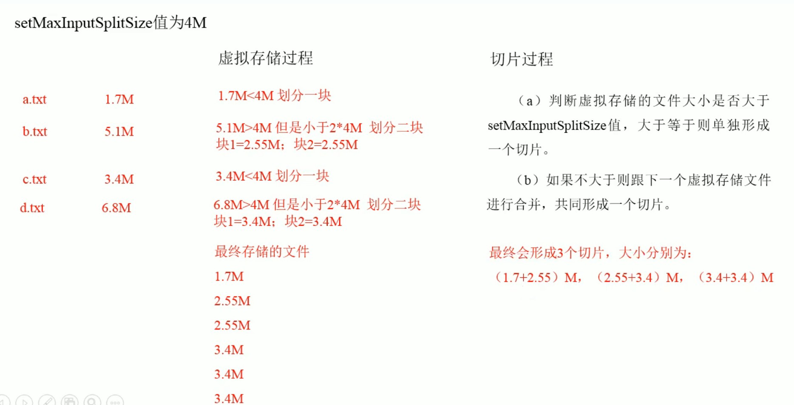

# 第三章 MapReduce框架原理

## 3.1 InputFormat数据输入

### 3.1.1 切片与MapTask并行度决定机制

- ### 1.问题引出

  MapTask的并行度决定Map阶段的任务处理的并发度，进而影响到整个Job的处理速度。

  <font color='red'>思考：1G的数据，启动8个MapTask，可以提高集群的并发处理能力。那么1K的数据，也启动8个MapTesk，会提高集群的性能么？MapTask并行任务是否越多越好呢？哪些因素影响了MapTask的并发度？</font>

- ### 2. MapTask并发度机制

  **数据块：**Block是HDFS物理上把数据分成一块一块

  **数据切片：**数据切片只是在逻辑上对数据输入进行切片，并不会在磁盘上将其切分成片进行存储。

  **数据切片与MapTask并行度决定机制**


### 3.1.2 Job提交流程源码和切片源码详解

- ##### 1. Job提交流程源码

  ```java
  job.waitForCompletion(true);
  	submit();
  		// 1.建立连接
  		connect();
  			// 1) 创建提交Job代理
  			new Cluster(getConfiguration());
  				// (1) 判断是本地yarn还是远程（集群）
  				initialize(jobTrackAddr, conf);
  		// 2.提交Job
  		submitter.submitJobInternal(Job.this, cluster);
  			// 1) 创建给集群提交数据的Stag路径
  			JobSubmissionFiles.getStagingDir(cluster, conf);
  			// 2) 获取JobID，并创建Job路径
  			submitClient.getNewJobID();
  			// 3) 拷贝Jar包到集群
  			copyAndConfigureFiles(job, submitJobDir);
  				rUploader.uploadResources(job, jobSubmitDir);
  			// 4) 计算切片，生成切片规则文件
  			writeSplits(job, submitJobDir);
  			// 5) 向stag路径写入XML配置文件
  			writeConf(conf, submitJobFile);
  				conf.writeXml(out);
  			// 6) 提交Job，返回提交状态
  			submitClient.submitJob(jobId, submitJobDir.toString(), job.getCredentials());
  			// 7) 删除配置文件
  			jtFs.delete(submitJobDir, true);
          // 3. 将状态置为RUNNING
          state = JobState.RUNNING;
  ```

  

### 3.1.3 FileInputFormat切片机制

### 3.1.4 CombineTextInputFormat切片机制

 	框架默认的TextInputFormat切片机制是对任务按文件规划切片，<font color='red'>不管文件多小，都会是一个单独的切片</font>，都会交给一个MapTask，这样如果有大量小文件，就<font color="red">会产生大量的MapTask</font>，处理效率极其低下

1. #### 应用场景

   ​	CombineTextInputFormat用于小文件过多的场景，它可以将多个小文件从逻辑上规划到一个切片中，这样，多个小文件就可以交给一个MapTask处理

2. #### 虚拟存储切片最大值设置

   ​	CombineTextInputFormat.setMaxInputSplitSize(job,4194304); // 4m

   ​	注意：虚拟存储切片最大值设置最好根据实际的小文件大小情况来设置具体的值（1M，2M。。。128M）

3. ### 切片机制

   ​	生成切片过程包括：虚拟存储过程和切片过程两部分

   

### 3.1.5 CombineTextInputFormat案例实操

1. #### 需求

   ​	将输入的大量小文件，合并成一个切片统一处理

   ​	输入数据：4个小文件(1.7MB, 5.1MB, 3.4MB, 6.8MB)

   ​	期望：一个切片处理四个小文件

2. #### 实现过程

   1. 不做任何处理，运行1.8节的WordCount案例程序，观察切片个数为4

      number of split: 4

   2. 在WordcountDriver中增加一下代码，运行程序，并观察运行的切片个数为3.

      1. 驱动类中添加代码如下：

         ```java
         // 如果不设置InputFormat，它默认用的是TextInputFormat.class
         job.setInputFormatClass(CombineTextInputFormat.class);
         // 虚拟存储切片最大值设置 4M
         CombineTextInputFormat.setMaxInputSplitSize(job, 4194304);
         ```

      2. 运行结果为3个切片

         number of split: 3

   3. 在WordcountDriver中增加如下代码，运行程序，并观察运行的切片个数为1。

      1. 驱动类中添加如下代码

         ```java
         // 如果不设置InputFormat，它默认用的是TextInputFormat.class
         job.setInputFormatClass(CombineTextInputFormat.class);
         // 虚拟存储切片最大值设置 4M
         CombineTextInputFormat.setMaxInputSplitSize(job, 20971520);
         ```

      2. 运行结果为1个切片

         number of split: 1

      * **注：一般生产中都将大量的小文件放在一个切片中，如128MB**

### 3.1.6 FileInputFormat实现类

​	思考：<font color="red">在运行MapReduce程序时，输入的文件格式包括：基于行的日志文件、二进制格式文件、数据库表等</font>。那么，针对不同的数据类型，MapReduce是如何读取这些数据的呢？

​	FileInputFormat常见的接口实现类包括：<font color="red">TextInputFormat（文本）、KeyValueTextInputFormat（kv对）、NLineInputFormat（按行处理）、CombineTextInputFormat（小文件）和自定义InputFormat</font>等。


