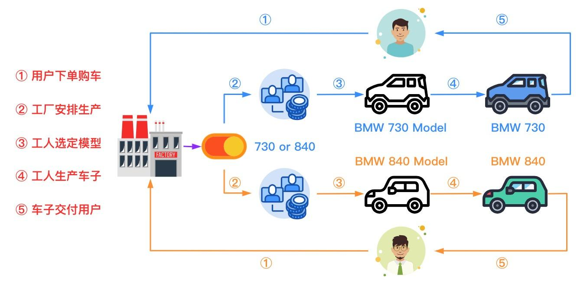
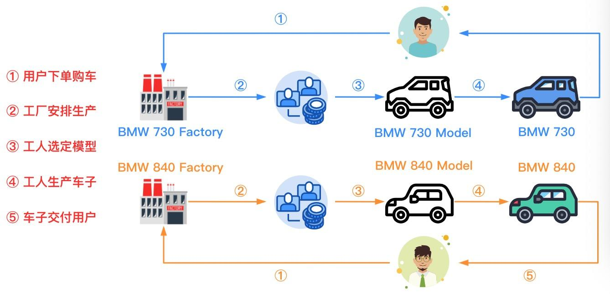

# 3. 工厂模式

​	工厂模式提供了**创建对象**的最佳方式，工厂模式分为三种：**简单工厂模式、工厂方法模式和抽象工厂模式**

## 3.1 简单工厂模式(SimpleFactoryPattern)

​	简单工厂模式又被称为**静态方法模式**，因为工厂中定义了一个静态方法用于创建对象。简单工厂模式让使用者不用知道具体的参数就可以创建出所需要的“产品”类，即使用者可以直接消费产品而不需要知道产品的具体生产细节。

### 3.1.1 案例

​	王二和小xx分别向BMW工厂订购了BMW730和BMW840型号的车子，工厂通过用户判断车型并生产交付给用户。



### 3.1.2 代码实现

```java
public interface  BMW {

    public  void run();
}

public class BMW730 implements BMW{

    @Override
    public void run() { System.out.println("BMW730 GO!!!"); }
}


public class BMW840 implements BMW{

    @Override
    public void run() { System.out.println("BMW840 GO GO GO!!!"); }
}

public class BMWFactory {

    public static BMW produceBMW(String model){

        if ("730".equals(model)) {
            return new BMW730();
        } else {
            return new BMW840();
        }
    }
}

public class SimpleFactory {

    @Test
    public void simpleFactoryTest(){

        BMW bmw730 = BMWFactory.produceBMW("730");
        BMW bmw840 = BMWFactory.produceBMW("840");

        bmw730.run();
        bmw840.run();
    }
}
```

### 3.1.3 应用场景

- 工厂类负责创建的对象比较少：由于创建对象比较少，不会造成工厂方法中业务逻辑过于复杂。
- 客户端只需要知道传入工厂类静态方法的参数，而不需要关心创建对象的细节。

### 3.1.4 缺点

- 工厂类集中了所有实例（产品）的创建逻辑，一旦这个工厂不能正常工作，整个系统都会受到影响；
- 违背“开放 - 关闭原则”，一旦添加新产品就不得不修改工厂类的逻辑，这样就会造成工厂逻辑过于复杂。
- 简单工厂模式由于使用了静态工厂方法，静态方法不能被继承和重写，会造成工厂角色无法形成基于继承的等级结构。

## 3.2 工厂方法模式(FactoryMethodPattern)

​	工厂方法模式又称为工厂模式，也叫多态工厂（Polymorphic Factory）模式，属于类创建型模式

​	工厂方法模式中，工厂父类负责定义创建产品对象的公共接口，而工厂子类负责生成具体的产品对象，**这样做的目的是将产品类的实例化操作延迟到工厂子类中完成**，即通过工厂子类来确定究竟应该实例化哪一个具体产品类。

### 3.2.1 案例

​	分别向 BMW 730 和 BMW 840 工厂订购了 BMW730 和 BMW840 型号的车子，接着工厂按照对应的模型进行生产并在生产完成后交付给用户。



### 3.2.2 代码实现

```java
// 产品类同3.2.1

public interface BMWFactory {

    BMW produceBMW();
}

public class BMW730Factory implements BMWFactory{
    @Override
    public BMW produceBMW() { return new BMW730(); }
}

public class BMW840Factory implements BMWFactory{
    @Override
    public BMW produceBMW() { return new BMW840(); }
}

public class FactoryMethod {

    @Test
    public void factoryMethodTest(){
        BMW730Factory bmw730Factory = new BMW730Factory();
        BMW840Factory bmw840Factory = new BMW840Factory();

        BMW bmw730 = bmw730Factory.produceBMW();
        BMW bmw840 = bmw840Factory.produceBMW();

        bmw730.run();
        bmw840.run();
    }
}

```

