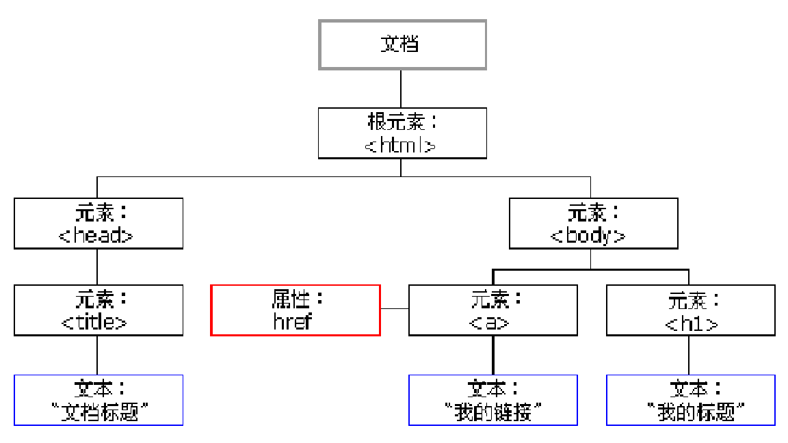

## DOM

#### 什么是DOM

- DOM -- Document Object Model 文档对象模型

- 可以通过js操作网页

- 文档 

  - HTML网页

- 对象

  - 网页中的每一部分都转化为对象  -- 一切皆对象（标签、文本、注释等都是对象）

- 模型

  - 用来表示对象之间的关系，方便我们获取对象

### 节点 Node

- 构成网页的基本组成部分，网页中的每一部分都可以称为节点（标签、属性、文本等）
- 节点类型不同，常用节点分为四类
  - **文档节点：**整个HTML网页
  - **元素节点：**HTML中的HTML标签
  - **属性节点：**元素的属性
  - **文本节点：**HTML标签中的文本内容

#### 节点的属性

|          | nodeName  | nodeType | nodeValue |
| :------- | :-------- | -------- | --------- |
| 文档节点 | #document | 9        | nul       |
| 元素节点 | 标签名    | 1        | null      |
| 属性节点 | 属性名    | 2        | 属性值    |
| 文本节点 | #text     | 3        | ⭐文本内容 |

### 事件

- 事件：文档或浏览器窗口中发生的一些特定的交互瞬间
- js和html通过事件进行交互
- 如点击/键盘响应等

### 获取元素节点

- 通过document对象调用
  1. getElementById()
     - 通过**id**属性获取**一个**元素节点对象
  2. getElementsByTagName()
     - 通过**标签名**获取**一组**元素节点对象
  3. getElementsByName()
     - 通过**name**属性获取**一组**元素节点对象

### 获取元素节点的子节点

- 通过具体元素节点调用
  - getElementsByTagName()
    - -方法，返回当前节点的指定标签名后代节点
  - childNodes
    - -属性，表示当前节点的所有子节点
  - firstChild/lastChild
    - -属性，表示当前节点的第一个/最后一个子节点

### 获取父节点和兄弟节点

- 通过具体的节点调用
  - parentNode
    - -属性，表示当前节点的父节点
  - previousSibling
    - -属性，表示当前节点的前一个兄弟节点
  - nextSibling
    - -属性，表示当前节点的后一个兄弟节点

