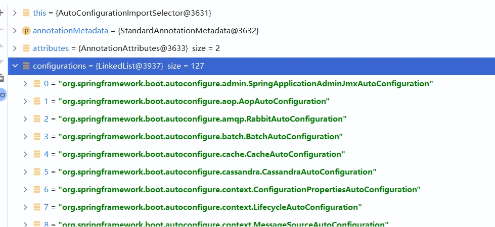

# 一、Spring Boot入门

## 1. Spring Boot简介

> 简化Spring应用开发的一个框架；
>
> 整个Spring技术栈的一个大整合；
>
> J2EE开发的一站式解决方案；

## 2. 微服务

2014年，[Martin Fowler](www.martinflowler.com)

微服务：架构风格

一个应用应该是一组小型服务；可以通过HTTP的方式进行互通；

每一个功能元素最终都是一个可独立替换、可独立升级的软件的单元。

## 3. 初始配置

### 3.1 maven配置

```xml
<profile>
	<id>jdk-1.8</id>
  <activation>
  	<activeByDefault>true</activeByDefault>
    <jdk>1.8</jdk>
  </activation>
  <properties>
  	<maven.compiler.source>1.8</maven.compiler.source>
    <maven.compiler.target>1.8</maven.compiler.target>
    <maven.compiler.compilerVersion>1.8</maven.compiler.compilerVersion>
  </properties>
</profile>
```

## 4. Spring Boot HelloWorld

功能：浏览器发送hello请求，服务器接受请求并处理，响应Hello World字符串。

1. 创建一个maven工程（jar）

2. 导入Spring Boot相关依赖

   ```xml
   <parent>
     <artifactId>spring-boot-starter-parent</artifactId>
     <groupId>org.springframework.boot</groupId>
     <version>2.3.6.RELEASE</version>
   </parent>
   <dependencies>
     <dependency>
       <groupId>org.springframework.boot</groupId>
       <artifactId>spring-boot-starter-web</artifactId>
     </dependency>
   </dependencies>
   ```

3. 编写主程序 -- 启动Spring应用

   ```java
   import org.springframework.boot.SpringApplication;
   import org.springframework.boot.autoconfigure.SpringBootApplication;
   
   // 标注主程序类，说明这是一个Spring Boot应用
   @SpringBootApplication
   public class HelloWorldMainApplication {
   
       public static void main(String[] args) {
           // Spring应用启动
           SpringApplication.run(HelloWorldMainApplication.class);
       }
   }
   ```

4. 编写相关的controller、service

   ```java
   import org.springframework.stereotype.Controller;
   import org.springframework.web.bind.annotation.RequestMapping;
   import org.springframework.web.bind.annotation.ResponseBody;
   
   @Controller
   public class helloController {
   
       @ResponseBody
       @RequestMapping("/hello")
       public String hello() {
           return "hello world!";
       }
   }
   ```

5. 运行主程序测试

   1. 浏览器中输入http://localhost:8080/hello向服务中发送请求，并收到程序中的"hello world!"返回

6. 部署

   1. 导入Spring Boot插件，并打包

      ```xml
      <build>
          <plugins>
              <plugin>
                  <groupId>org.springframework.boot</groupId>
                  <artifactId>spring-boot-maven-plugin</artifactId>
              </plugin>
          </plugins>
      </build>
      ```

   2. 使用java -jar xxx.jar启动服务

## 5. Hello World探究

### 5.1 POM文件

1. 父项目

   ```xml
   <parent>
     <artifactId>spring-boot-starter-parent</artifactId>
     <groupId>org.springframework.boot</groupId>
     <version>2.3.6.RELEASE</version>
   </parent>
   
   <!-- spring-boot-starter-parent的父项目 -->
   
   <parent>
     <groupId>org.springframework.boot</groupId>
     <artifactId>spring-boot-dependencies</artifactId>
     <version>2.3.6.RELEASE</version>
   </parent>
   ```

    spring-boot-dependencies真正管理Spring Boot应用的所有**依赖版本，称为仲裁中心**，所以所有已经被管理的依赖导入时不需要添加版本号，不存在则添加。

2. 导入的依赖

   ```xml
   <dependency>
     <groupId>org.springframework.boot</groupId>
     <artifactId>spring-boot-starter-web</artifactId>
   </dependency>
   ```

   spring-boot-starter-web：

   ​	spring-boot-start：场景启动器

   ​	spring-boot-starter-web：导入web模块正常运行所依赖的组件

   Spring Boot将所有的功能场景都抽取出来，做成不同的starter（启动器），只需要在项目里里面引入这些starter，相关场景的所有依赖都会导入进来。需要什么功能导入什么场景的启动器即可

### 5.2 主程序类（主入口类）

```java
import org.springframework.boot.SpringApplication;
import org.springframework.boot.autoconfigure.SpringBootApplication;

// 标注主程序类，说明这是一个Spring Boot应用
@SpringBootApplication
public class HelloWorldMainApplication {

    public static void main(String[] args) {
        // Spring应用启动
        SpringApplication.run(HelloWorldMainApplication.class);
    }
}
```

@SpringBootApplication：Spring Boot应用标注在某个类上，说明这个类是Spring Boot的主配置类，Spring Boot就应该运行这个类的main方法来启动Spring Boot应用。

```java
@Target({ElementType.TYPE})
@Retention(RetentionPolicy.RUNTIME)
@Documented
@Inherited
@SpringBootConfiguration
@EnableAutoConfiguration
@ComponentScan(
    excludeFilters = {@Filter(
    type = FilterType.CUSTOM,
    classes = {TypeExcludeFilter.class}
), @Filter(
    type = FilterType.CUSTOM,
    classes = {AutoConfigurationExcludeFilter.class}
)}
)
public @interface SpringBootApplication { ... }
```

**@SpringBootConfiguration**：Spring Boot的配置类

​	标注在某个类上，表示这个一个Spring Boot配置类

​	@Configuration：配置类上标注这个注解  -- Spring定义的注解，配置类也是Spring容器里的一个组件（@Component）

**@EnableAutoConfiguration**：开启自动配置功能

​	以前我们需要配是的东西，Spring Boot帮助我们自动配置，**@EnableAutoConfiguration**告诉SPring Boot开启自动配置功能，这样自动配置才会生效。

```java
@AutoConfigurationPackage
@Import({AutoConfigurationImportSelector.class})
public @interface EnableAutoConfiguration { ... }
```

​	**@AutoConfigurationPackage**：自动配置包

​		==将主配置类（@SpringBootApplication标注的类）所在包及下面所有子包里面的所有组件扫描到Spring容器中。==

​		@Import({Registrar.class})：Spring的底层注解@import，给容器中导入一个组件；导入到组件由Registrar.class决定

​	@Import({AutoConfigurationImportSelector.class})：导入那些组件的选择器

​		将所有需要导入的组件以全类名的方式返回；这些组件就会被添加到容器中

​		会给容器中导入非常多的自动配置类（xxxAutoConfiguration）；就是给容器中导入这个场景需要的所有组件并配置好这些组件

​	

​		有了自动配置类，就免去了手动编写配置、注入功能组件等工作；

​		SpringFactoriesLoader.loadFactoryNames(this.getSpringFactoriesLoaderFactoryClass(), this.getBeanClassLoader());

​		==Spring Boot在启动的时候从类路径下的META-INF/spring.factories中获取EnableAutoConfiguration指定的值，将这些值作为自动配置类导入到容器中，自动配置类就生效了，帮助我们完成自动配置工作。==以前我们需要自己配置的东西，自动配置类会自动配置

​		J2EE的整体解决方案和自动配置都在spring-boot-autoconfiguration-2.3.6.RELEASE.jar中

## 6. 使用Spring Initializer快速创建Spring Boot项目

IDE支持使用Spring的项目创建向导快速创建一个Spring Boot项目

选择我们需要的模块，向导会联网创建Spring Boot项目

默认生成的Spring Boot项目：

- 主程序已经生成，只需要编写业务逻辑即可
- resources文件夹中目录结构
  - static：保存所有的静态资源 -- js css images等
  - templates：保存所有的模板页面（Spring Boot默认jar包使用嵌入式的Tomcat，默认不支持JSP页面），可以使用模板引擎（freemarker、thymeleaf）
  - application.properties：Spring Boot应用的配置文件，可以修改一些默认设置

