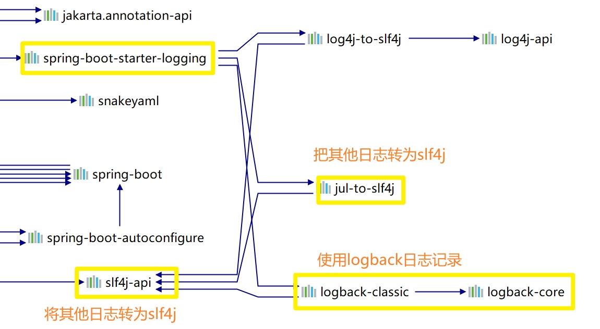

# 三、Spring Boot与日志

## 1. 日志框架

日志框架：JUL、JCL、Jboss-logging、logback、log4j、log4j2、slf4j...

| 日志门面（抽象层）                                           | 日志实现（实现层）                                           |
| ------------------------------------------------------------ | ------------------------------------------------------------ |
| ~~JCL（Jakarta Commons Logging）~~（2014，已停止更新）<br /><font color="red">SLF4j（Simple Logging Facade for Java）</font><br />~~boss-logging~~ | Log4j<br />JUL（java.util.logging）<br />Log4j2<br /><font color="red">Logback</font> |

左边选一个门面（抽象层）：SLF4j

右边选一个实现：Logback（Log4j存在性能问题，作者推出Logback（相当于Log4j的升级版本），而后顺势推出SLF4j门面。而Log4j2是由Apache公司借Log4j之名推出的日志框架（设计很优秀））


Spring Boot：底层是Spring框架，Spring框架默认是用JCL

==Spring Boot选用SLF4j和Logback==

## 2. SLF4j使用

### 2.1 如何在系统中使用SLF4j

以后开发的时候，日志记录的方法的调用，不应该直接调用日志的实现类，而应该调用日志抽象层里面的方法。

给系统里面导入SFL4j的jar包和logback的实现jar

```java
import org.slf4j.Logger;
import org.slf4j.LoggerFactory;

public class HelloWorld {
  public static void main(String[] args) {
    Logger logger = LoggerFactory.getLogger(HelloWorld.class);
    logger.info("Hello World");
  }
}
```


每一个日志的实现框架都有自己的配置文件。使用SLF4j，**配置文件还是做成日志实现框架自己本身的配置文件。**

### 2.2 遗留问题

a系统（slf4j+logback）：Spring（commons-logging）、Hibernate（jboss-logging）、MyBatis、xxx

统一日志记录，即使使用别的日志框架也统一使用slf4j+logback进行输出


如何让系统所有的日志都统一到slf4j：

1. 将系统中其他日志框架先排除出去
2. 用中间包来替换原有的日志框架
3. 导入slf4j其他的实现

## 3. Sping Boot日志关系

```xml
 <dependency>
   <groupId>org.springframework.boot</groupId>
   <artifactId>spring-boot-starter</artifactId>
   <version>2.4.0</version>
   <scope>compile</scope>
</dependency>
```

Spring Boot使用下面依赖来完成日志功能

```xml
<dependency>
  <groupId>org.springframework.boot</groupId>
  <artifactId>spring-boot-starter-logging</artifactId>
  <version>2.4.0</version>
  <scope>compile</scope>
</dependency>
```

Spring Boot底层依赖关系



总结：

1. Spring Boot底层也是使用slf4j+logback的方式进行日志记录
2. Spring Boot也把其他的日志都替换成了slf4j
3. 中间替换包
4. **如果我们要引入其他框架，一定要把这个框架的默认框架移除掉**
5. Spring框架默认用的commons-logging（Spring Boot 2.x没有将其排除）
6. Spring Boot能自动适配所有日志，而且底层使用slf4j+logback的方式记录日志，引入其他框架的时候，只需要把这个框架依赖的日志框架排除掉

## 4. 日志使用

### 4.1 默认配置

Spring Boot默认已经配置好了日志

```java
// 记录器
Logger logger = LoggerFactory.getLogger(getClass());

@Test
void contextLoads() {

  // 日志级别，由低到高trace debug info warn error
  // 可以调整需要输出的日志级别，只打印当前及更高级别的日志
  logger.trace("这是 trace 日志");
  logger.debug("这是 debug 日志");
  // Spring Boot默认的日志级别为info（root级别）
  // 可以再配置文件中指定日志级别
  logger.info("这是 info 日志");
  logger.warn("这是 warnr日志");
  logger.error("这是 error日志");
}
```

Spring Boot通过配置文件修改默认配置

```properties
# 指定日志级别 logger.level{.packagePath}，指定包下的日志级别
logging.level.pers.learn=trace
# 指定日志输出到文件（如果不指定则只输出到控制台）
# 只指定文件名则在当前项目下生成文件，也可以指定日志位置：./log/log.log或d:/log/log.log
# logging.file=log.log Spring Boot 1.x中使用
logging。file.name=log.log
# 指定文件路径
# /sping/log表示在项目所在磁盘的根目录下创建/spring/log文件夹，并使用Spring Boot默认的spring.log文件作为默认日志文件
# logging.path=/spring/log Spring Boot1.x版本中使用
logging.file.path=/spring/log

# 在控制台中日志输出的格式
# %d：日期时间，后面接{}，里面书写日期时间格式
# %thread：线程，[%thread]表示在[]里面输出，并无特殊含义
# %-5level：左对齐并固定输出五个字符宽度
# %logger{50}：输出logger名字，即类名。{n}可以控制长度
# %-msg：输出日志内容
# %n：换行
logging.pattern.console=%d{yyyy-MM-dd}[%thread] %-10level %logger{50} - %msg%n
# 在文件中日志输出的格式
logging.pattern.file=%d{yyyy-MM-dd HH:mm:ss.SSS} == [%thread] == %-10level == %logger{50} == %msg%n
```

### 4.2 [指定配置](https://docs.spring.io/spring-boot/docs/current/reference/html/spring-boot-features.html#boot-features-logging)

给类路径下添加每个日志的框架对应的配置文件即可，Spring Boot就不使用默认配置

| **Logging System**      | **Customization**                                            |
| ----------------------- | ------------------------------------------------------------ |
| Logback                 | **logback-spring.xml**`, `logback-spring.groovy`, `logback.xml`, or `logback.groovy |
| Log4j2                  | **log4j2-spring.xml**` or `log4j2.xml                        |
| JDK (Java Util Logging) | logging.properties                                           |

loback.xml：直接被日志框架识别

**logback-spring.xml**：日志框架内不能被直接加载日志配置项，而是由Spring Boot识别，由此可以使用Spring Boot中的特定功能

​	通过使用<springProfile>标签来指定某段配置只在某个环境中生效

```properties
<springProfile name="staging">
    <!-- configuration to be enabled when the "staging" profile is active -->
</springProfile>

<springProfile name="dev | staging">
    <!-- configuration to be enabled when the "dev" or "staging" profiles are active -->
</springProfile>

<springProfile name="!production">
    <!-- configuration to be enabled when the "production" profile is not active -->
</springProfile>
```

### 4.3 日志框架切换

可以按照slf4j[日志适配图](#2.2 遗留问题)，进行相关的切换 -- 将logback切换为log4j

```xml
<dependencies>
  <dependency>
    <groupId>org.springframework.boot</groupId>
    <artifactId>spring-boot-starter-web</artifactId>
    <exclusions>
      <exclusion>
        <artifactId>logback-classic</artifactId>
        <groupId>ch.qos.logback</groupId>
      </exclusion>
      <exclusion>
        <artifactId>log4j-to-slf4j</artifactId>
        <groupId>org.apache.logging.log4j</groupId>
      </exclusion>
    </exclusions>
  </dependency>
  
  <dependency>
    <groupId>org.slf4j</groupId>
    <artifactId>slf4j-log4j12</artifactId>
  </dependency>
</dependencies>
```

将slf4j切换为slf4j2

```xml
<dependency>
  <groupId>org.springframework.boot</groupId>
  <artifactId>spring-boot-starter-web</artifactId>
  <exclusions>
    <exclusion>
      <artifactId>spring-boot-starter-logging</artifactId>
      <groupId>org.springframework.boot</groupId>
    </exclusion>
  </exclusions>
</dependency>

<dependency>
  <groupId>org.springframework.boot</groupId>
  <artifactId>spring-boot-starter-log4j2</artifactId>
</dependency>
```


