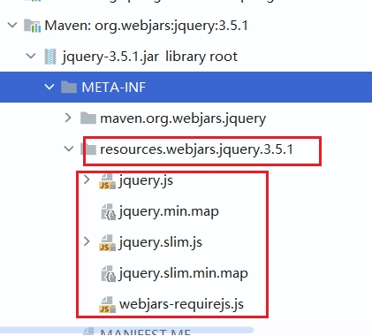

# 四、Web开发

使用Spring Boot：

1. 创建Spring Boot应用，选中我们需要的模块
2. Spring Boot已经默认将这些场景配置好，只需要在配置文件中指定少量配置就可以运行起来
3. 编写业务代码

自动配置原理

​	考虑每引入一个场景，Spring Boot配置了什么？能不能修改？能修改哪些配置？能不能扩展...

> xxxAutoConfiguration：帮助我们给容器中自动配置组件
>
> xxxProperties：配置类来封装配置文件的内容

## 2. Spring Boot对静态资源的映射规则

web相关配置在*WebMvcAutoConfiguration.java*中

```java
	@Override
		public void addResourceHandlers(ResourceHandlerRegistry registry) {
			if (!this.resourceProperties.isAddMappings()) {
				logger.debug("Default resource handling disabled");
				return;
			}
			Duration cachePeriod = this.resourceProperties.getCache().getPeriod();
			CacheControl cacheControl = this.resourceProperties.getCache().getCachecontrol().toHttpCacheControl();
			if (!registry.hasMappingForPattern("/webjars/**")) {
				customizeResourceHandlerRegistration(registry.addResourceHandler("/webjars/**")
						.addResourceLocations("classpath:/META-INF/resources/webjars/")
						.setCachePeriod(getSeconds(cachePeriod)).setCacheControl(cacheControl)
						.setUseLastModified(this.resourceProperties.getCache().isUseLastModified()));
			}
			String staticPathPattern = this.mvcProperties.getStaticPathPattern();
			if (!registry.hasMappingForPattern(staticPathPattern)) {
				customizeResourceHandlerRegistration(registry.addResourceHandler(staticPathPattern)
						.addResourceLocations(getResourceLocations(this.resourceProperties.getStaticLocations()))
						.setCachePeriod(getSeconds(cachePeriod)).setCacheControl(cacheControl)
						.setUseLastModified(this.resourceProperties.getCache().isUseLastModified()));
			}
		}
			
	// 配置欢迎页
	@Bean
		public WelcomePageHandlerMapping welcomePageHandlerMapping(ApplicationContext applicationContext,
				FormattingConversionService mvcConversionService, ResourceUrlProvider mvcResourceUrlProvider) {
			WelcomePageHandlerMapping welcomePageHandlerMapping = new WelcomePageHandlerMapping(
					new TemplateAvailabilityProviders(applicationContext), applicationContext, getWelcomePage(),
					this.mvcProperties.getStaticPathPattern());
			welcomePageHandlerMapping.setInterceptors(getInterceptors(mvcConversionService, mvcResourceUrlProvider));
			welcomePageHandlerMapping.setCorsConfigurations(getCorsConfigurations());
			return welcomePageHandlerMapping;
		}
```

1. 所有/webjars/\*\*都去**classpath:/META-INF/resources/webjars/**找资源

   [webjars](https://www.webjars.org/)：以jar的方式引入静态资源

   

   http://localhost:8080/webjars/jquery/3.5.1/jquery.js

   1. 访问公共资源

      ```xml
      <!-- 引入jquery-webjar -->
      <!-- 在访问的时候只需要写webjars下面的资源名称即可 -->
      <dependency>
        <groupId>org.webjars</groupId>
        <artifactId>jquery</artifactId>
        <version>3.5.1</version>
      </dependency>
      <!-- 访问jar包中的META-INFO/resources/webjars/...里面的文件即可
      ```

   2. "/\*\*"访问当前项目的任何资源（静态资源的文件夹）

      classpath：/src/main/java/、/src/main/resource/

      ```java
      "classpath:/META-INF/resources/", 
      "classpath:/resources/", 
      "classpath:/static/", 
      "classpath:/public/"
      "/" //当前项目的根路径
      ```

      如：访问localhost:8080/abc，如果没人处理则访问上面的静态资源文件夹来寻找abc

   3. 欢迎页：静态资源文件夹下的所有index.html页面；被"/\*\*"映射、

   4. ~~所有的\*\*/favicon.ico都在静态资源文件夹下找~~（SPring Boot 2.x已经取消此方法）

   5. 通过配置spring.web.resources.static-locations=classpath:/hello/来配置静态资源文件夹，如果配置了静态资源文件夹则默认配置不生效。

## 3. 模板引擎

JSP、Velocity、Freemarker、Thymeleaf

**template + data -> template Engine -> html页面**

### 3.1 Thymeleaf

Spring Boot推荐Thymeleaf：语法更简单，功能更强大

#### 3.1.1 引入Themeleaf

```xml
<!-- thymeleaf, Spring Boot2.4默认支持3.0.11-->
<dependency>
  <groupId>org.springframework.boot</groupId>
  <artifactId>spring-boot-starter-thymeleaf</artifactId>
</dependency>
<!-- thymeleaf3.x 适配layout2，thymeleaf2.x适配layout1 -->

<!-- 切换版本,Spring Boot2.x 不需要切换 -->
<thymeleaf.version>3.0.11-RELEASE</thymeleaf.version>
<themeleaf-layout-dialect.version>2.5.1</themeleaf-layout-dialect.version>
```

