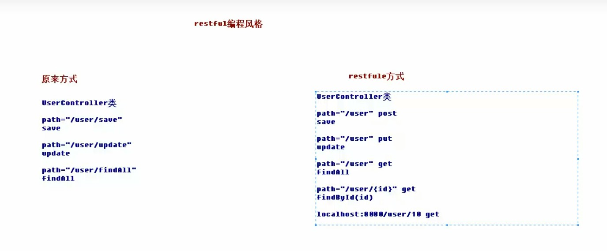

# 2.常用注解

### 1.RequestParam

作用：

​	把请求中指定名称的参数给控制器重点形参赋值

属性：

​	value：请求参数的名称

​	required：请求参数中是否必须提供此参数。

​		默认值：ture，如果不提供则报错

### 2.RequestBody

作用：

​	用于获取请求体内容。直接使用得到的是key=value&key=value...结构的数据

​	get请求不适用

属性：

​	required：是否必须包含请求体

​		默认值：true，如果为ture时，get请求会报错；如果为false时，get请求得到的是null

#### 3.PathVariable

作用：

​	用于获取绑定url中的占位符。例如请求url中/delete/{id}，这个{id}就是url占位符。

​	url支持占位符是spring3.0之后加入的。是springmvc支持rest风格url的一个重要标志

属性：

​	value：用于指定url中占位符名称

​	required：是否必须提供占位符

#### 3.1 REST风格URL

##### 1.什么是rest

​	REST(Representational State Transfer，简称REST)描述了一个框架样式的网络系统，比如web应用程序。他首次出现在2000年Roy Fielding的博士论文中，他是HTTP规范的只用编写者之一。在目前主流的三种web服务交互方案中，REST相比于SOAP（Simple Object Access Protocol，简单对象访问协议）以及XML-RPC更加简单明了，无论是对URL的处理还是对Payload的编码，REST都倾向于用更加简单轻量的方法设计和实现。值得注意的是REST并没有一个明确的标准，而更像一种设计的风格

​	它本身没有什么实用性，其核心价值在于如何设计出符合REST风格的网络接口

2.restful的优点

​	结构清晰、符合标准、易于理解、扩展方便，所以正得到越来越多网络的采用

3.restful的特性

​	资源（Resouces): 网络上的一个实体，或者说是网络上的一个具体信息

​		它可以是一段文本、一张图片、一首歌曲、一种服务，总是就是一种具体的存在。可以用一个URI（统一资源定位符）指向它，每种资源对应一个特定的URI。要获取这个资源，访问它的URI就可以，因此，URI即为每一个资源的独一无二的识别符。

​	表现层（Representation）：把资源具体呈现出来的形式，叫做它表现层（Representation）

​		比如，文本可以用text格式表现，也可以用HTML格式、XML格式、JSON格式表现，设置可以采用二进制格式

​	状态转化（State Transfer））：每发出一个请求，就代表了客户端和服务器的一次交互过程

​		HTTP协议，是一种无状态协议，即所有的状态都保存在服务器端。因此如果客户端想要操作服务器，必须通过某种手段，让服务器发生“状态变化”（State Transfer）。而这种转化是建立在表现层之上的，所以就是“表现层状态转化”。具体说，就是HTTP协议里面，四个代表操作方式的动词：GET、POST、PUT、DELETE。他们分别对应四种基本操作：GET--用来获取资源，POST--用来新建资源，PUT用来更新资源，DELETE用来删除资源

### 4.RequestHeader

作用：用于获取消息头

属性：

​	value：提供消息头名称

​	required：是否必须有此消息头

注：

​	在实际开发中一般不会用到

#### 5.CookieValue

作用：

​	用于把指定	方法参数

属性：

​	value：指定cookie的名称

​	required：是否必须有此cookiex

注：

​	比较少用

### 6.ModelAttribute

作用：

​	该注解是SpringMVC4.3版本以后新加入的。它可以修饰**方法和参数**
​	添加到方法上：

​		表示当前方法会在控制器的方法执行之前执行。它可以修饰没有返回值的方法，也可以修饰有具体返回值的方法

​	添加在参数上：

​		获取指定的数据给参数赋值

属性：

​	value：用于获取数据的key。key可以是POJO的属性名称，也可以是map结构的key。

应用场景：

​	当表单提交的数据不是完整的实体类数据时，保证没有提交数据的字段使用数据库对象原来的数据。

举例：

​	我们在编辑一个用户时，用户有一个创建信息字段，该字段的值是不允许被修改的。在提交表单数据是可定没有此字段内容，一旦更新，会把该字段内容置为null，此时就可以使用此注解解决问题。

### 7.SessionAttribute

作用：	

​	用于多次执行控制器方法间的参数共享

属性：

​	value：用于指定存入的属性名称

​	type：用于指定存入的数据类型