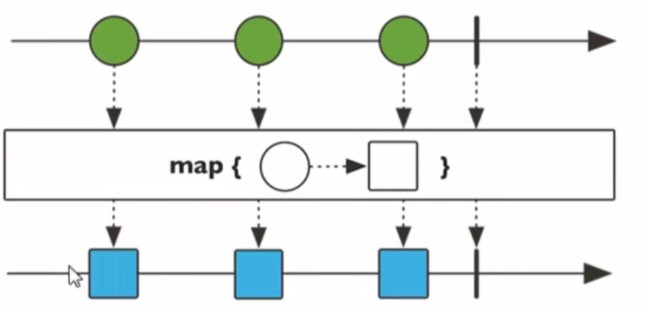
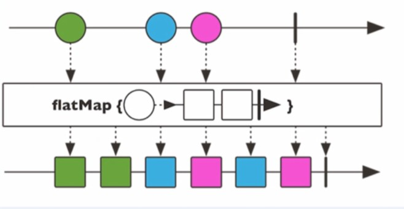

# 11.Spring5框架新功能（WebFlux）

## 11.1 SpringWebFlux介绍

### 11.1 前置知识

- SpringMVC
- SpringBoot
- Maven
- Java8新特性：Lambda表达式、Stream流

### 11.2 介绍

1. 是Spring5添加的新的模块，用于web开发，功能与SpringMVC类似，WebFlux使用当前一种比较流行的响应式编程出现的框架
2. 使用传统web框架，如SpringMVC，这些基于Servlet容器，WebFlux是一种异步非阻塞的框架，异步非阻塞框架再Servlet3.1以后才支持，核心是基于Reatctor的相关API实现的

### 11.3 WebFlux特点

1. 非阻塞式：在有限的资源下，提高系统吞吐量和伸缩性，以Reactor为基础实现响应式编程
2. 函数式编程：Spring5框架基于Java8，WebFlux使用Java8函数式编程方式实现路由请求

### 11.4 比较SpringMVC

- SpringMVC：

  - Imperationv logic, simple to write and debug
  - JDBC, JPA, blocking deps

- COMMON:

  - @Controller
  - Reactiove clients
  - Tomcat, Jetty, Undertow

- Spring WebFlux

  - Functional endpoints
  - Event loop concurrency model
  - Netty

  两者都可以使用注解方式，都运行在Tomcat等容器中

  SpringMVC采用命令式编程，WebFlux采用异步响应式编程

## 11.2 响应式编程（Reactive Programming，RP）

​	响应式编程是一种面向数据流和变化传播的编程范式。这意味着，可以在编程语言中很方便的表达静态或动态的数据流，而相关的计算模型会自动将变化的值通过数据流进行传播。（如excel中= A1 + B1公式的值会随着A1和B1的值的变化而变化）

​	Java8及以前的版本，提供的观察者模式（哨兵）两个类Observer和Observable（响应式编程就是观察者模式中的一种）

```java
public class ObserverDemo extexds Observable{

    public static void main(String[] args) {
        ObserverDemo observerDemo = new ObserverDemo();
        // 添加观察者
        observerDemo.addObserver((o, arg) -> {
            System.out.println("发生了变化...");
        });

        observerDemo.addObserver((0,arg) -> {
            System.out.println("手动被观察者通知，准备改变。。。");
        })

        // 数据变化
        observerDemo.setChanged();

        // 通知
        observerDemo.notifyObservers()
    }
}
```

## 11.3 Webflue执行流程及核心API

1. 响应式编程操作中，Reator是满足Reactive规范框架

2. 核心类：Mono、Flux，两个类都实现了Publisher，提供了丰富的操作符。Flux对象实现发布者，返回N个元素；Mono实现发布者，返回0或1个元素。

3. Flux和Mono都是数据流的发布者，使用Flux和Mono都可以发出三种数据信号：<font color="red">元素信号、错误信号和完成信号，错误信号和完成信号都代表终止信号</font>，终止信号用于告诉订阅者数据流结束了。错误信号终止数据流同时把错误信息传递给订阅者。

4. 代码演示

   1. 引入reactor依赖

      ```xml
      <dependency>
          <groupId>io.projectreactor</groupId>
          <artifactId>reactor-bom</artifactId>
          <version>Bismuth-RELEASE</version>
          <type>pom</type>
          <scope>import</scope>
      </dependency>
      ```

   2. 编程代码
   
      ```java
      public static void main(String[] args) {
      
          // just方法直接声名相关的元素
          Flux.just(1, 2, 3, 4);
          Mono.just(1);
      
          // 其他方法
          Integer[] array = {1, 2, 3, 4};
          Flux.fromArray(array);
      
          List<Integer> list = Arrays.asList(array);
          Flux.fromIterable(list);
      
          Stream<Integer> stream = list.stream();
          Flux.fromStream(stream);
      }
      ```
   
5. 三种信号特点

   - 错误信号和完成信号都是终止信号，但是不能共存
   - 如果没有发送任何的元素值，而是直接发送错误信号或完成信号，则为空数据流
   - 如果没有错误信号或完成信号，则表示无限数据流

6. 调用just或其他方法只是声名了数据流，并没有发出，只有进行订阅后才能触发数据流，不订阅则什么都不会发生

   ```java
   // 订阅输出数据流
   Flux.just(1, 2, 3, 4).subscribe(System.out::println);
   Mono.just(1).subscribe(System.out::println);
   ```

7. 操作符

   - 对数据流进行的相关操作称为操作符，例：工厂流水线

   - 常见操作符

     - map：元素映射为新的元素

       

     - flatmap：把元素映射为stream

       将每个元素转换成流，再将各个流合并成一个流

       

## 11.4 SpringWebFlux（基于注解编程模型）

​	SpringWebFlux基于Reactor，默认容器时Netty，Netty是高性能的NIO（异步非阻塞）框架。

- Netty
  - BIO -- 阻塞方式

## 11.5 SpringWebFlux（基于函数式编程模型）