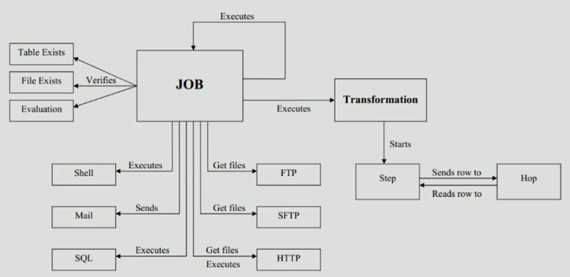

# 01. Kettle简介

### ETL简介

   ETL（Extract-Transform-Load，即**数据抽取、转换、装载**的过程），对于企业或行业应用来说，我们经常遇到各种数据数据的处理，转换，迁移，所以了解并账务一种ETL工具的使用，必不可少。

### Kettle简介

Kettle是一款国外开源的ETL，纯Java编写，可以在Windows、Linux、Unix上运行，绿色无需安装，数据抽取高效稳定

Kettle中文名为水壶，该项目的主程序员MATT希望把各种数据放到水壶里，然后以一种**指定的格式**流出

Kettle这个ETL工具集，它允许你管理来自**不同数据库的数据**，通过提供一个**图形化** 的用户环境来描述**你想做什么，最不是你想怎么做**

Kettle中又两种脚本文件，**transformation和job**，transformation完成针对数据的基础转换，job则完成整个工作流的控制

Kettle（现在已经更名为**PDI**，Pentaho Data Integration-Pentaho数据集成）。

#### Kettle的结构-Spoon和Data Integration Server

Spoon是构建ETL **Jobs**和**Transformations**的工具。Spoon以**推拽的方式图形化**设计，能够通过Spoon调用**专用的数据集成引擎**或**集群**

Data Integration Server是一个专用的**ETL Server**，它的主要功能有

| 功能     | 描述                                                         |
| -------- | ------------------------------------------------------------ |
| 执行     | 通过Pentaho Data Integration引擎执行ETL的作业或转换          |
| 安全性   | 管理用户、角色或继承的安全性                                 |
| 内容管理 | 提供一个继承的资源库，用来管理ETL的作业和转换。资源库包含所有内容和特征的历史版本 |
| 时序安排 | 在Spoon设计者环境中提供管理Data Integration Server上的活动的时序和监控服务 |

#### Kettle的机构-Enterprise Console

Enterprise Console（企业控制台）提供了一个**小型客户端**，用于管理Pentaho Data Integration**企业版的部署**

包括企业版本的**证书管理、监控和远程控制Pentaho Data Integration服务器上的活动、分析已登记的作业和转换的动态绩效**

#### Kettle的核心组件

| 名称    | 描述                                                       |
| ------- | ---------------------------------------------------------- |
| Spoon   | 通过图形接口，用于编辑作业和转换的桌面应用                 |
| Pan     | 一个独立的命令行程序，用于执行由Spoon编辑的转换和作业      |
| Kitchen | 一个独立的命令行程序，用于执行由Spoon编辑的作业            |
| Carte   | Carte是一个轻量级的Web容器，用于建立专用、远程的ETL Server |

#### Kettle概念模型

Kettle的执行分为两个层次：Job（作业）和Transfromation（转换）

